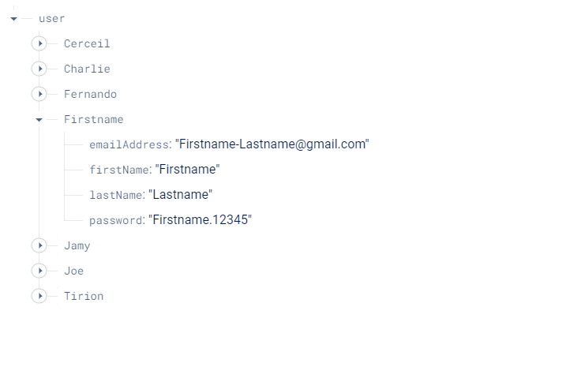

# Frontend Mentor - Intro component with sign up form solution

This is a solution to the [Intro component with sign up form challenge on Frontend Mentor](https://www.frontendmentor.io/challenges/intro-component-with-signup-form-5cf91bd49edda32581d28fd1). Frontend Mentor challenges help you improve your coding skills by building realistic projects. 

## Table of contents

- [Overview](#overview)
  - [The challenge](#the-challenge)
  - [Screenshot](#screenshot)
  - [Links](#links)
- [My process](#my-process)
  - [Built with](#built-with)
  - [What I learned](#what-i-learned)
  - [Continued development](#continued-development)
  - [Useful resources](#useful-resources)
- [Author](#author)
- [Acknowledgments](#acknowledgments)

## Overview

### The challenge

Users should be able to:

- View the optimal layout for the site depending on their device's screen size
- See hover states for all interactive elements on the page
- Receive an error message when the `form` is submitted if:
  - Any `input` field is empty. The message for this error should say *"[Field Name] cannot be empty"*
  - The email address is not formatted correctly (i.e. a correct email address should have this structure: `name@host.tld`). The message for this error should say *"Looks like this is not an email"*

  **PS: firebase + submit alert ....**

### Screenshot

### Links

- Solution Design: [Figma - only Desktop View](https://www.figma.com/file/XJeeX7mLhLa4GOrtFNzpRc/signup-form?type=design&mode=design&t=2pJQDxuug6tJdrfN-1)
- Solution Users Story: [Figma - Diagram](https://www.figma.com/file/1a6Sj0CaarcrDQm6I8qY2s/signup-form---diagram---user-story?type=whiteboard&node-id=975%3A342&t=ZNFxXD0rtXn6fnoL-1)

- Solution URL: [Github - repository](https://github.com/404diaby/intro-component-with-sign-up-form)
- Live Site URL: [Vercel - hosting](https://intro-component-with-sign-up-form-one-mocha.vercel.app/)

**PS: The first two was optional. A simple initiative on my part.**
## My process

### Built with

- Semantic HTML5 markup
- css animation
- Flexbox
- Firebase

### What I learned

### Continued development

Actually I don't really manage perfectly data with javascript but  I really care about this so I'm going to look into it

### Useful resources

- [MDN page resource](https://developer.mozilla.org/fr/docs/Learn/Forms/Form_validation) - This helped me to manage form after sunbmissiob. I really liked this website and will use it going forward.
- [Youtube video to use Firebase](https://www.youtube.com/watch?v=2crtIMKf9bs&ab_channel=CreativeTutorial) - This is an simple and amazing video which helped me finally understand little bit NO-SQL with Firebase. I'd recommend it to anyone still learning this concept.
- [css animations  resources](https://animista.net/) - This is an amazing website which  there are lot of css animation to make yours website more smooth. I'd recommend it to anyone.
- [readme generator](https://readme.so/fr/editor) - This is a website which you can edit your readme file and look each change in life. An others awesome website I discover.

## 🔗 Author

